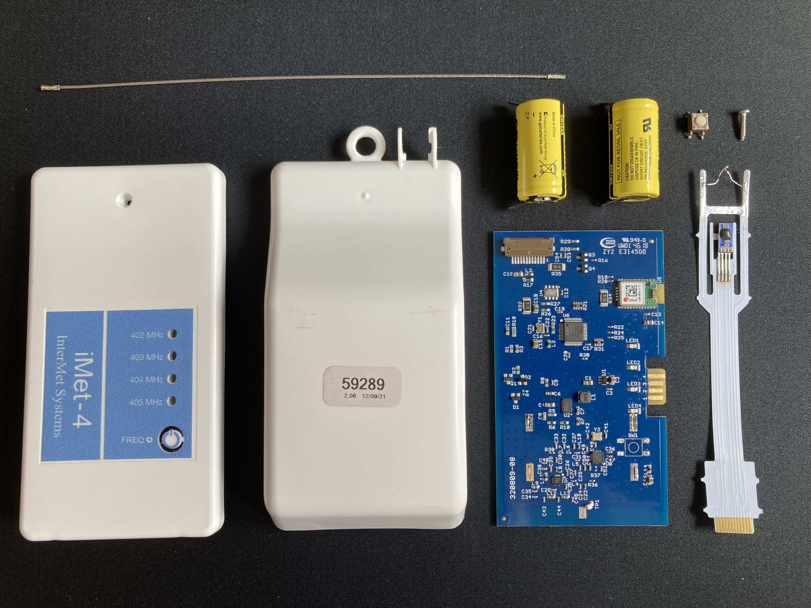
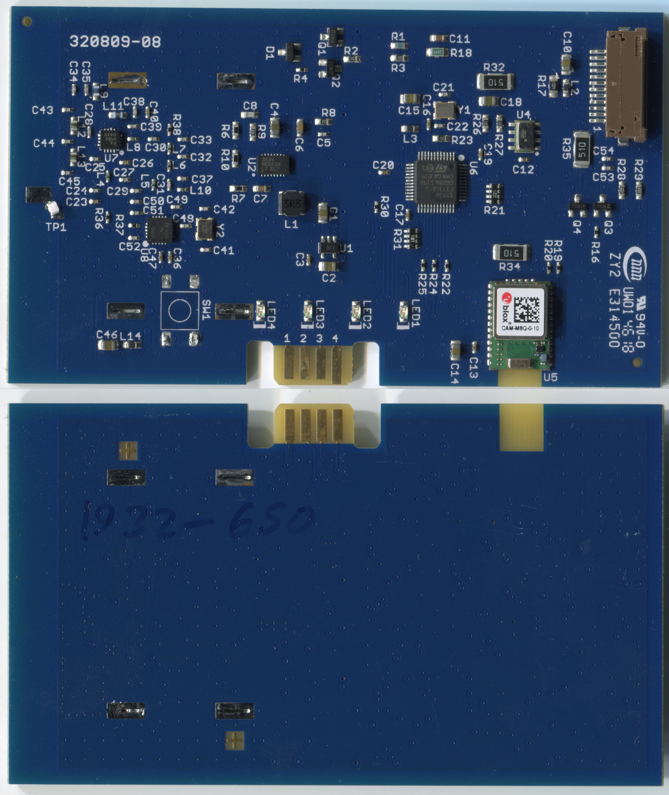
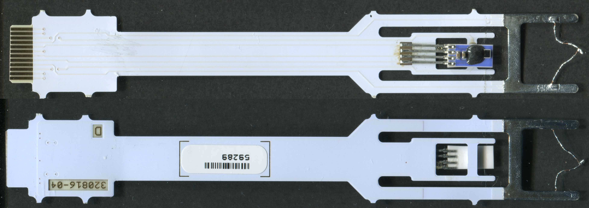
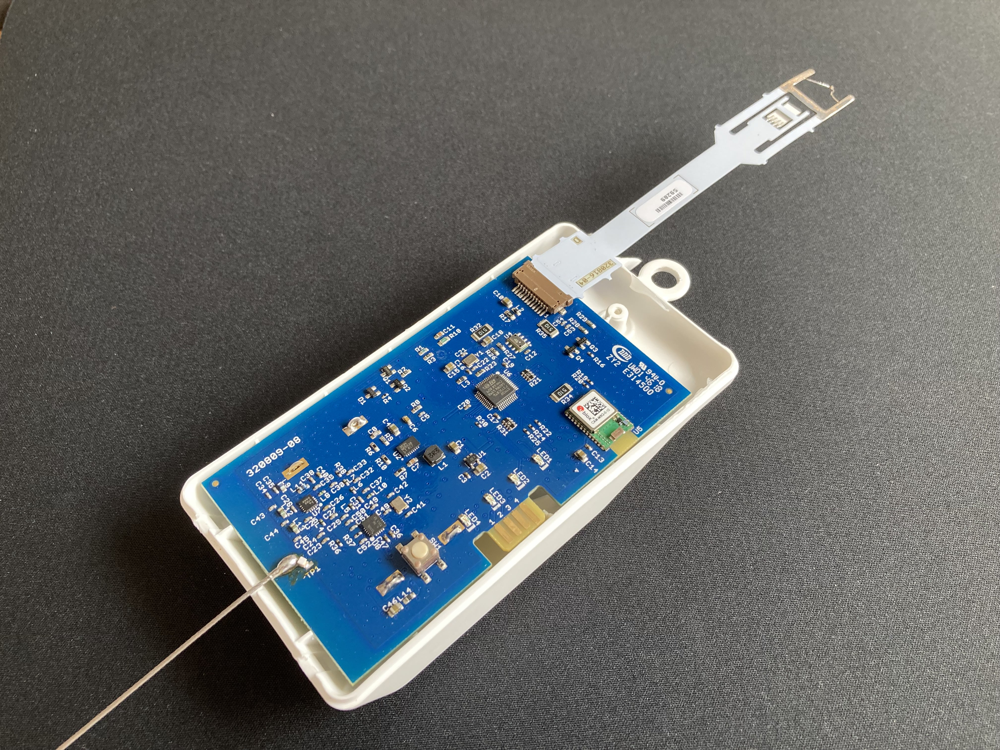
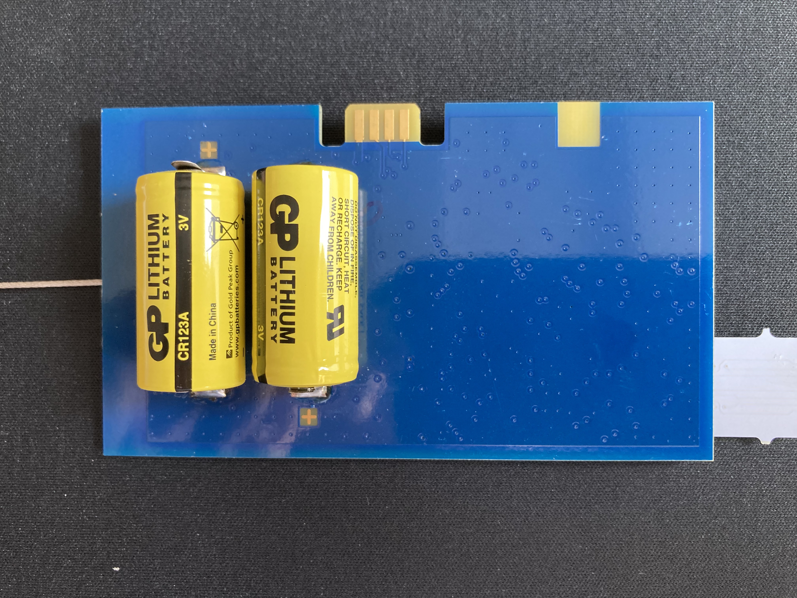

# InterMet Systems (US) iMet-4

## Description

**Assembled Radiosonde**

**Exploded View**

Still some stuff missing here...

## Theory of Operations

**Main PCB Scan**

**Sensor Boom Scan**

### General
The InterMet iMet-4 appears to be the flagship radiosonde of the US InterMet Branch. The History of InterMet is quite fragmented, first starting out as an israelian company, than spitting of in two braches, one in the USA and one in South African, producing similar but slightly different hardware. iMet Radiosondes originally used the 1680 Mhz Band and were tracked using radiotheolodites, though they now use a more common 403 MHz system. Customers are mostly the respective Israelian and South African met offices. The sonde analyzed here was flown by Belgian airbase Beauvechain after their switchover from Graw DFM-09 on 16.02.2020 and captured by DJ6OI, who also provided the photos. Thank you very much, Thomas! Since I yet was not able to capture a sonde myself, I could not check any connection on the pcb yet.

The iMet-4 looks similar to an RS41 on a first glance. The sensor boom is on a similar position, and also penetrates through the sonde body on the top. The sondes case in made of hard plastic as well, but is missing any kind of Styrofoam insulation. The internal configuration is more similar to Graws DFM-17 with two adjacent CR123a cells on the lower half of the rear side of the pcb. Unlike the DFM-17, the cells are of the type with welded solder tabs, like the ones used in Graws DFM-09. The cell provider of this batch was GP.

As InterMet uses an operational approach wich completly lacks any ground check, there is no connection for a ground ceck device whatsoever. The user turns on the sonde unsing a tactile button and selects the frequency in 500 kHz steps indicated by four LEDs directly at the sonde using the same button. A 8-pin card edge connector ist present and is most likely used in production and for xdata enabled variants of the sonde.

The sonde uses a four layer pcb with three signal layer (front, inner 1 and 2) and a ground layer on the back. This decision seems odd, as the low component count easily could have been routed on a two-layer board. The component placement is all over the place and the routing is no better.

### PSU
Power supply is mainly handled by an [Analog Devices LTC3534](https://www.analog.com/media/en/technical-documentation/data-sheets/3534fb.pdf) Buck-Boost Converter and an undisclosed SOT23-5 LDO with the same pinout as the [MAX8887](https://datasheets.maximintegrated.com/en/ds/MAX8887-MAX8888.pdf). Turning on the sonde is most likely managed by the cluster of `Q1`, `Q2` and `D1` near the Switching Regulator. It has to be noted that the switch has on leg connected to ground, which seems unlikely if it enables the switching regulator in some way. Maybe it is a DPST switch?

### GNSS
InterMet was lazy and traded in design cost for BOM cost by using an [uBlox CAM-M8Q](https://www.u-blox.com/en/product/cam-m8-series) module with an integrated chip antenna. The placement is very odd however. One would expect the module to be placed with the antenna on the top edge of the pcb since this yields the [most equal azimuthal gain distribution](https://pulselarsenantennas.com/wp-content/uploads/2017/01/W3011_W3011A.pdf) on a pcb with limited dimensions, and more importantly given the directivity of the antenna towards the top. Is this just stupidity by InterMet or am I overlooking some non-intuitive RF voodoo?

### MCU + PTU
Following the trend with STM32s in radiosondes, a [ST STM32F373CB](https://www.st.com/en/microcontrollers-microprocessors/stm32f373cb.html) is used. This quite a beast, featuring a Cortex-M4 core with dedicated FPU, 3x 16-Bit ΔΣ-ADCs, 2x DACs and Comparators and a ton of timers. As InterMet is doing all there calculations in the air and is just sending down the finished results down to earth, a hefty MCU is obviously not a bad thing. As powerful as the MCU though, as spartan is the PTU circuitry, or lack thereof. Given the ΔΣ-ADCs, an external ADC or Resistance-to-Time converter can not be expected, but even the best ΔΣ-ADC can not measure capacity directly. MeteoModem achieves their minimal BOM count through an good'ol 555 timer converting capacitance to time, maybe InterMet implements something similar using the tons of peripherals within their MCU?

The only components which are most likely involved with the PTU circuitry are the precise looking resistors `R1` and `R18`, as well as well as `Q3`. It's counterpart below, `Q4`, seems to be involved in switching three 51R heating resistors. The pressure sensor is of the common [TE/Measurement Specialities MS5607/5611](https://www.te.com/commerce/DocumentDelivery/DDEController?Action=showdoc&DocId=Data+Sheet%7FMS5611-01BA03%7FB3%7Fpdf%7FEnglish%7FENG_DS_MS5611-01BA03_B3.pdf%7FCAT-BLPS0036) variety, and is connected via I2C. The sensor boom itself is connected via an 12-pin 0.5mm flatflex connector, with the 4 outermost pins being ground.

### Radio
InterMet is using AFSK Modulation with the Bell 202 standard. The output power is quite high and specified as +27 dBm max. Given the high output power and the uninsulated battery, battery lifetime is specified as >135 Min. which leads to the sonde seizing operation before burst sometimes. With this high of an output power, no one chip solution of the likes of Silabs Si4063 can be used, and an dedicated PA is necessary. The main radio IC is an [Texas Instruments CC115L](http://www.ti.com/lit/ds/symlink/cc115l.pdf), which is not supporting AFSK natively. Most likely, an approach as described by [Silabs here](https://www.silabs.com/community/wireless/proprietary/knowledge-base.entry.html/2016/09/08/afsk_signal_demodula-ahV2) is used. The PA by [Qorvo, the RFPA0133](https://www.mouser.de/datasheet/2/412/fpa0133_data_sheet-1500561.pdf) is a good fit, although requiring quite a few external components and not beeing cheap either.

## Parts List

Designator | Function | Part Number | Cost Estimate @Qty. 1000
--- | --- | --- | ---
U2 | BuckBoost | [Analog Devices LTC3534](https://www.analog.com/media/en/technical-documentation/data-sheets/3534fb.pdf) | 3.50 USD
 | GNSS | [uBlox CAM-M8Q](https://www.u-blox.com/en/product/cam-m8-series) | 13.69 USD
 U6 | MCU | [ST STM32F373CB](https://www.st.com/en/microcontrollers-microprocessors/stm32f373cb.html) | 2.44 USD
 U8 | Radio | [Texas Instruments CC115L](http://www.ti.com/lit/ds/symlink/cc115l.pdf) | 1.02 USD
 U7 | PA | [Qorvo RFPA0133](https://www.mouser.de/datasheet/2/412/fpa0133_data_sheet-1500561.pdf) | 2.44 USD
 U4 | Pressure Sensor | [TE/Meas MS5607/5611](https://www.te.com/commerce/DocumentDelivery/DDEController?Action=showdoc&DocId=Data+Sheet%7FMS5611-01BA03%7FB3%7Fpdf%7FEnglish%7FENG_DS_MS5611-01BA03_B3.pdf%7FCAT-BLPS0036) | 1.61 USD
 | Temperature Sensor | [Shibaura PSB-Sx Series](https://www.shibauraelectronics.com/products/thermistor/element/psb_s5.html) |
 | Humidity Sensor | [IST P14 Rapid](https://www.ist-ag.com/sites/default/files/DHP14-Rapid_E.pdf) |

## Detail Photos

