# Meteomodem M20

## Description

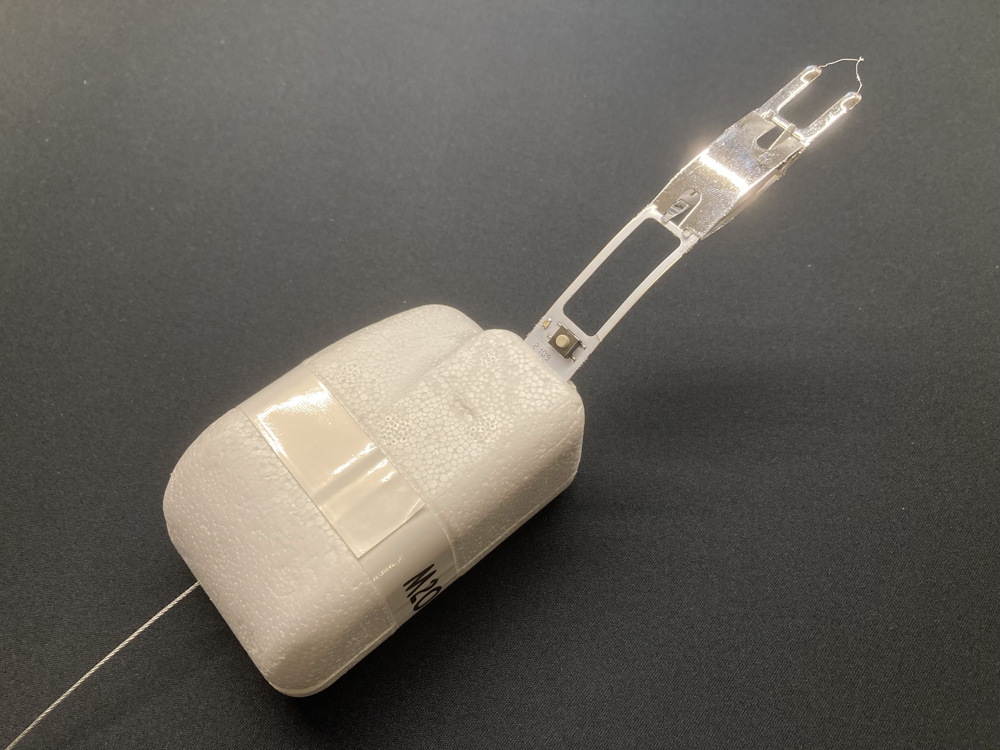
**Assembled Radiosonde**

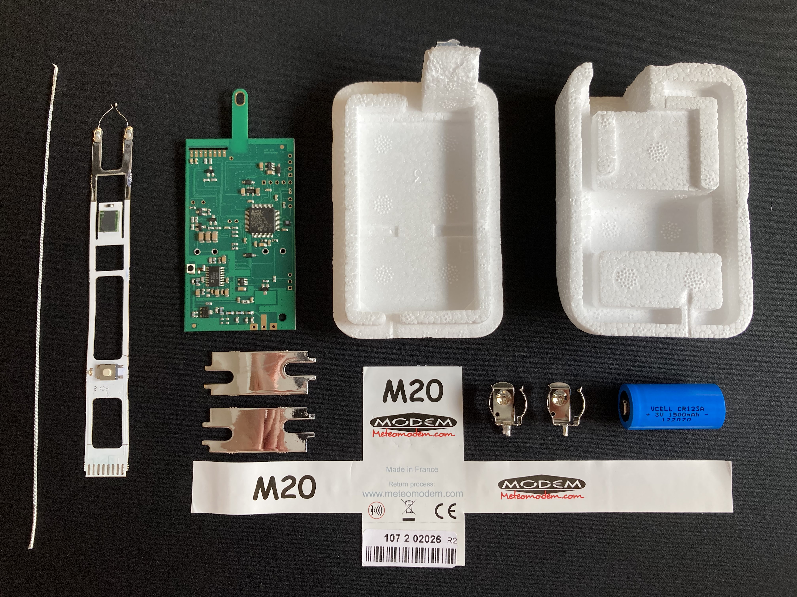
**Exploded View**

### MCU and GPS
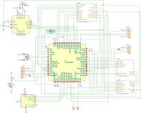

### Radio
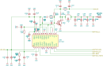

The Analog Devices ADF7012 FSK transmitter gets its reference clock from the 8 MHz MCO output of the MCU. The MCU handles the control interface of the radio via bit-banging over standard port pins. TX data is sent asynchronously to the ADF7012 TXDATA pin. The MCU generates transmit data with the help of TIMER21 and its TIM21_CH1 output. A PA (unknown type) boosts the output signal.

Modulation is 2FSK with 5.5 kHz deviation. Data bits are sent Biphase-M encoded in short bursts with 4800 bit/s (9600 smbols/s).

### Analog
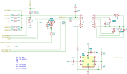

### Powersupply
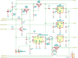

## Theory of Operations

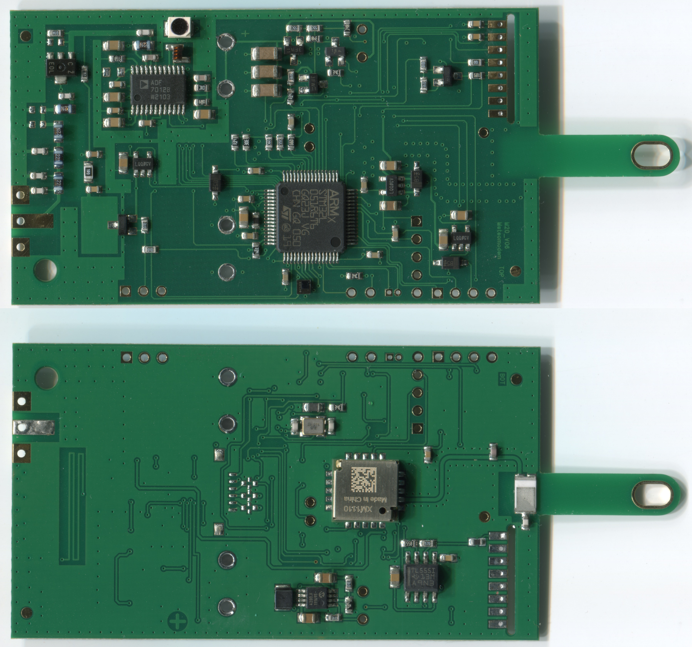
**Main PCB Scan**

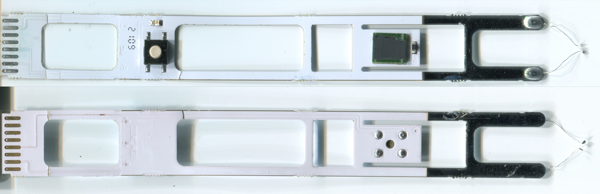
**Sensor Boom Scan**

Still some stuff missing here...

## Parts List

Still some stuff missing here...

## Detail Photos

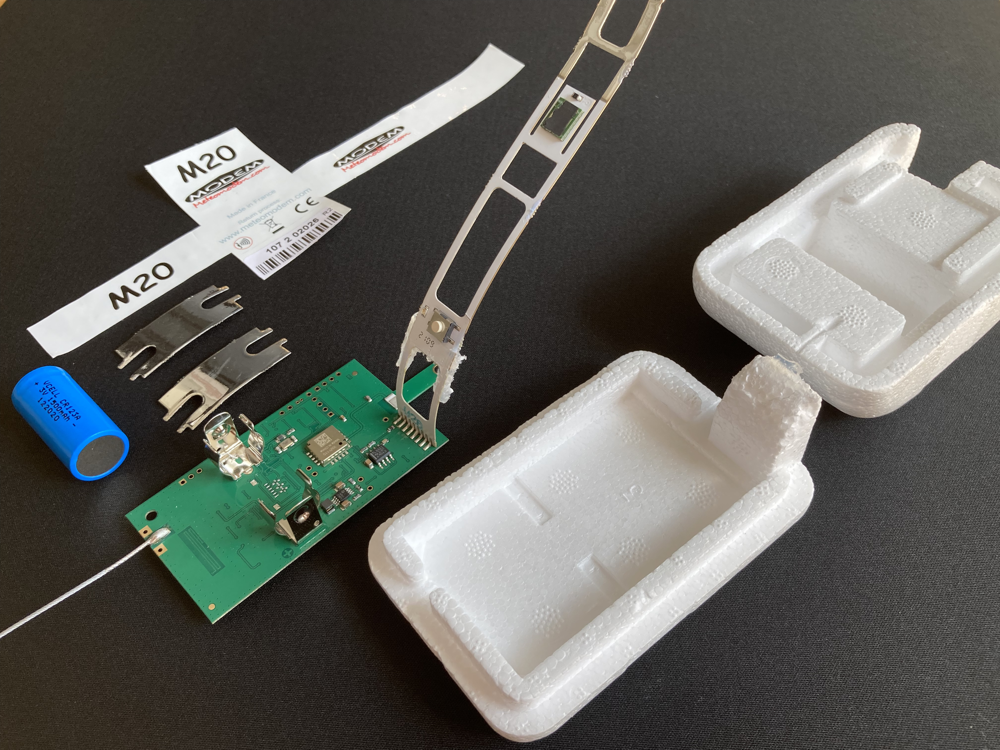

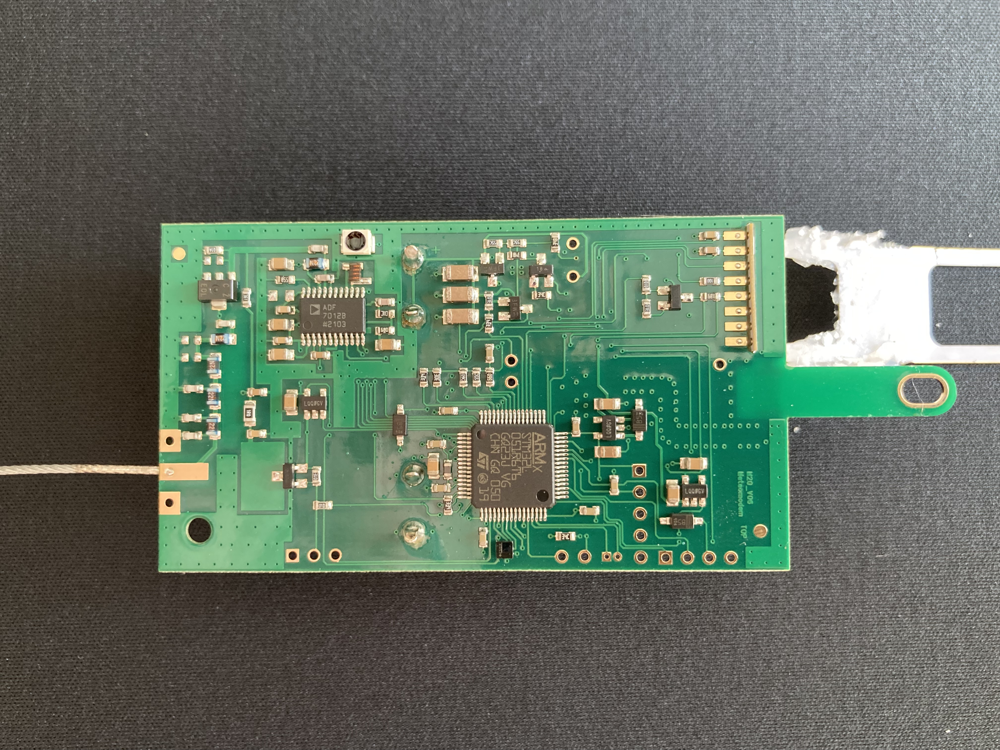

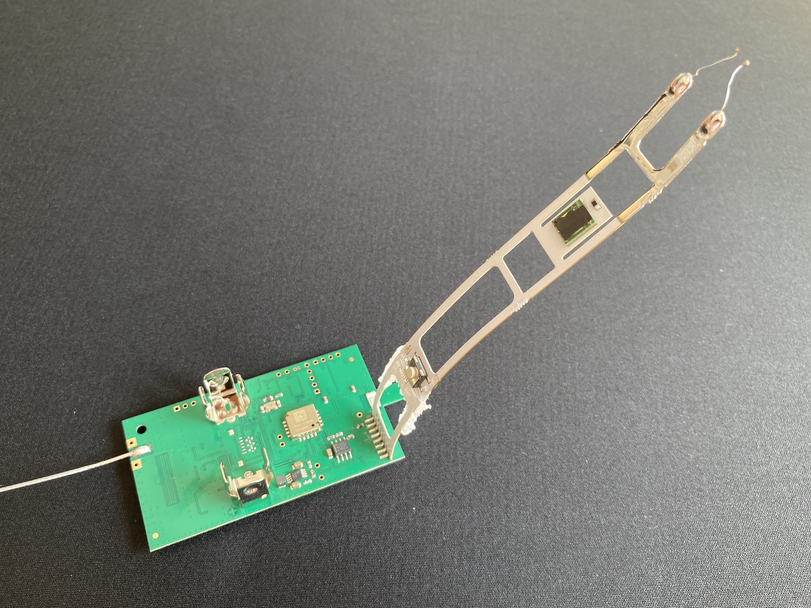

